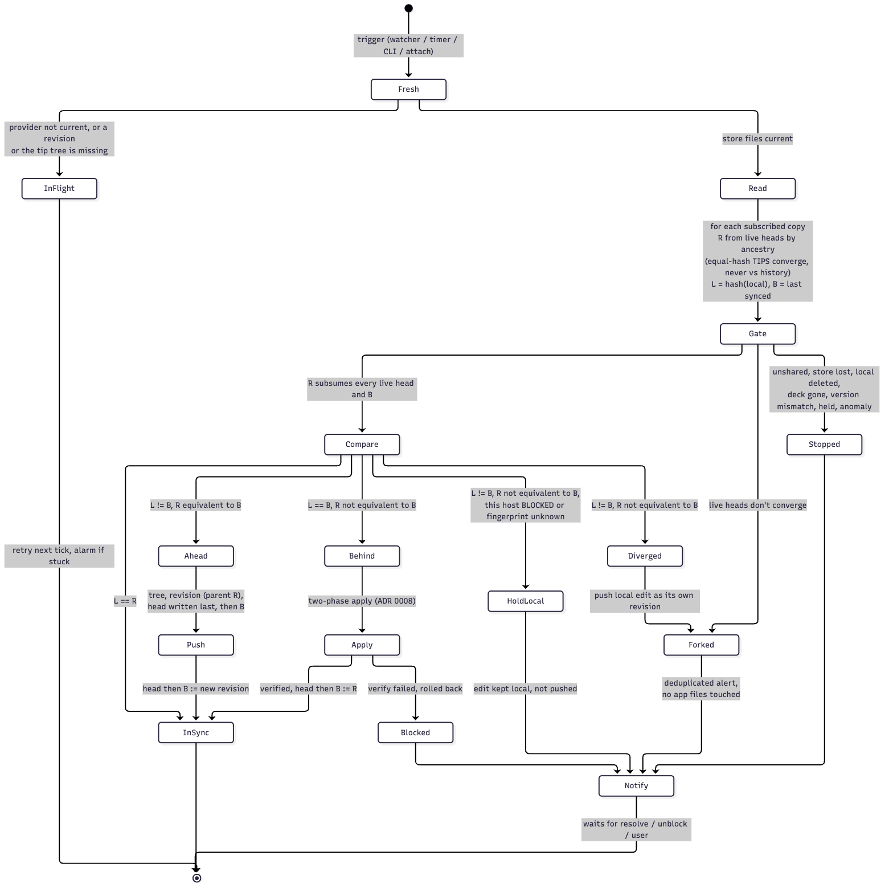

# schrodeck

*Your Stream Deck profile is in superposition across every Mac it has been on, until you attach a deck and it collapses into the latest state.*

Keep Elgato Stream Deck profiles in sync across several computers, including different physical decks with the same layout size, for example through a Thunderbolt or KVM switch, using nothing but a shared cloud folder (Dropbox, iCloud Drive, …).

> **Status: design phase.** No working code yet. See the [design spec](docs/specs/2026-10-01-sync-design.md) and the [architecture decision records](docs/adr/README.md).

## The problem

You edit a profile on Mac A, flip the switch, and Mac B shows yesterday's layout. The Stream Deck app keeps profiles per machine and has no automatic cross-machine sync.

## The approach

- You opt profiles in: `schrodeck share "Work"` on one machine, `schrodeck subscribe "Work"` on the others. The subscription can go onto any local deck with the same geometry (columns × rows, dials), including a virtual deck. Profiles you don't share are never touched.
- A small CLI (`schrodeck`, written in Go) runs on every machine from launchd. It runs when profile files or the shared folder change, on a safety timer, or by hand. It can optionally also run on deck attach.
- Every version of a shared profile is an immutable revision in the shared folder, and each machine writes only its own small "head" file, so no file ever has two writers. Comparing **normalized content hashes** against that history tells each machine whether it is behind, ahead, in sync, or diverged, without trusting file timestamps or clocks. Two machines editing at once produce a visible fork, never a silently lost edit.
- Behind → plan and verify the change first, quit the app, re-check that nothing changed while it quit, swap in the update, relaunch, and verify. If verification fails, roll back once and stop updating that version until you look at it. Ahead → publish to the shared folder. Diverged → keep both versions, touch nothing, notify once.
- Per-machine differences such as your home folder, or a service URL that differs on a firewalled machine, are handled with variables, so they never count as edits. It also reports which plugins, icon packs, Shortcuts, and scripts a profile needs and whether this machine has them.
- Repeated applies back off exponentially, so a bug can't turn into a restart loop; your own edits are never delayed. Deletes never propagate. Alerts are sent once per problem, not once per run.
- No network connection between the machines is needed. macOS first; the OS-specific parts sit behind interfaces so other platforms can be added later.

## Prior art

- [dominik-ba/stream-deck-profile-sync](https://github.com/dominik-ba/stream-deck-profile-sync): manual push/pull via a cloud folder. A good fit if you want to stay in control of when syncs happen.
- What Elgato documents vs. what we observed: [docs/references.md](docs/references.md)
- [Elgato: deploying profiles at scale](https://www.elgato.com/us/en/explorer/products/stream-deck/stream-deck-profiles-at-scale/). Note that Elgato does not officially support managing profile files directly. This tool therefore checks the app version and profile schema, and refuses to run on anything it doesn't recognize.

## Caveats

This works on the Stream Deck app's internal files, which Elgato may change in any update. It keeps backups before every change and is designed to stop rather than guess. Hopefully that is enough, but treat it as early software.

Not affiliated with or endorsed by Elgato or Corsair. "Elgato" and "Stream Deck" are trademarks of Corsair Memory, Inc.

Human-directed and AI-assisted: the design and every change are reviewed and steered by a human.

## License

[MPL-2.0](LICENSE). Contributions require a CLA; see [CONTRIBUTING.md](CONTRIBUTING.md).
