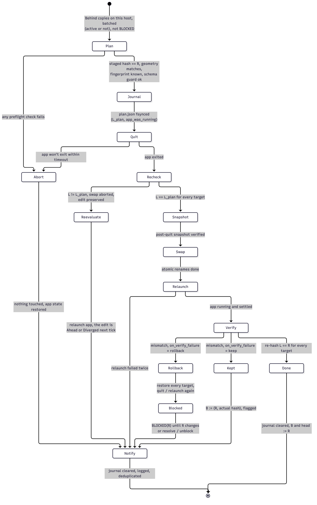

# 0008. Applying an update is plan → commit → verify, with a post-quit re-check

Status: Accepted 2026-10-01. Revised 2026-10-01 (review F2, F5, F6, F11, F12, F18): Revised 2026-10-01 (fail closed, [0030](0030-fail-closed-detach.md)): an unreadable or inconsistent journal detaches its targets instead of guessing. Revised 2026-10-01 (review F50, F51): installs regenerate `ActionID`s, and a rejoin archives the old copy inside the same apply. Revised 2026-10-02 (issue #5, owner's decision): the verify step moves that copy's own head; heads are per member copy. Revised 2026-10-02 (owner's decision): copies are applied **serially, one copy per apply cycle and app restart**, so a verify failure is always attributable to exactly one copy and rollback is per copy; replaces the batched, all-or-nothing-per-run apply.
- a post-quit re-check;
- the incoming fingerprint is validated;
- a verify failure ends in BLOCKED, not a retry loop;
- per-step journal recovery;
- the app's running state is restored;
- batched runs.

Revised 2026-10-01 (review round 2: F11, F33, F34):
- crash recovery always restores the app's running state;
- a verify failure that may be a settle-window edit says so, and `resolve` can publish the post-apply tree;
- B is set only after the head write.

## Context

Applying an update means replacing files of a running app. The app keeps state in memory and writes it back, so files changed under it get overwritten. Elgato says to close the app before changing its files ([R3](../references.md), documented). Elgato offers no CLI or URL to import or restart ([R17](../references.md)). Smart Profiles are deactivated while the Stream Deck window is open ([R13](../references.md)).

The review found that reading local state only **before** quitting loses edits. The user can change a button between the plan and the quit, and the app also flushes in-memory state while quitting. The swap then overwrites that edit (review scenario 2).

## Decision

**A run is ordered:**
1. Pushes.
2. Re-read the heads.
3. Apply every copy on this host that is Behind, **serially: one copy per apply cycle** (steps 1–9 below, one app restart each), in a deterministic order (by `copy_id`).

A cycle's targets are one copy, plus its archive on a rejoin. Two Behind copies on one host (two decks on one setup, or two setups on one deck) are two cycles and two restarts. This is deliberate (owner's decision): when a verify fails there is no ambiguity about which copy caused it, so rollback touches **only that copy**, and copies already applied in the run stay applied with their heads moved. After a failed cycle the run continues to the next copy only if the rollback brought the app back up healthy; otherwise the run stops and the remaining copies wait for the next tick.

**The app restart is the commit point (in the transaction sense). Everything that can fail is checked before it, and the local state is re-checked after the app has stopped writing.**

1. **Plan** (the app still runs, and nothing is touched). Abort on any failure:
   - For each target: the incoming revision's `fingerprint` is in this host's known-good set, and its `norm_version` matches ([0015](0015-schema-guard.md), [0006](0006-normalization-and-variables.md)).
   - The target is not BLOCKED for this R (below).
   - Stage each target in a scratch dir on the same volume. Placeholders are expanded with this host's values, `Device.UUID` is set to the receiving deck, every `ActionID` is regenerated deterministically, and the folder is named per [0026](0026-profile-identity.md). The staged copy must re-hash to `hash(R)` (the hash ignores `ActionID`). If an install's canonical folder already holds an old copy of the setup (a rejoin), the plan also stages the **archive**: a fresh folder UUID and the renamed `Name` for the old copy ([0026](0026-profile-identity.md), review F50). The archive is journaled like any other target.
   - Geometry matches ([0003](0003-decks-are-local-geometry-compatibility.md)).
   - Schema guard passes for this app version ([0015](0015-schema-guard.md)).
   - Free disk is sufficient.
   - Plugin presence check ([0014](0014-plugin-handling.md)): a missing plugin means apply anyway and notify. Only presence is needed here; the full inventory is M5.
   - Record **L_plan** for every target and whether the app was running (**app_was_running**).
2. **Journal:** write `plan.json` (targets, staged paths, L_plan, expected hashes, app_was_running, `step = planned`) and fsync it plus its directory. Each later step updates `step` with an fsync.
3. **Quit** the app gracefully and wait for it to exit (contract A's `AppControl.Quit` guarantee). On timeout, abort: nothing touched, and the app is left running.
4. **Post-quit re-check** (the app can no longer write): re-hash every target. If any **L ≠ L_plan**, the user or the app's quit-time flush changed the copy. **Abort the swap**, relaunch the app, and re-evaluate on the next tick. That copy is now Ahead or Diverged, and its edit is preserved.
5. **Snapshot** (after the quit, so it includes any flushed state): copy each target's current local tree into the local history ring and verify it. `step = snapshotted`.
6. **Swap** with atomic renames on the same volume (review F58). Before the **first** rename, write `step = swapping` plus a **rename ledger**: the ordered list of planned renames (source → destination) for every target, fsynced. After each rename, mark that ledger entry done (fsync). Then `step = swapped`.
   - A plain apply has two renames per target: the old folder **aside**, then the staged folder **in**. The aside location is **outside `ProfilesV3`** (in schrodeck's state directory, on the same volume, so the rename stays atomic), so the app can never load an aside folder as an extra profile.
   - A rejoin replaces the aside rename with the **archive** rename (the old copy moves to its archive folder inside `ProfilesV3`, where it stays as an ordinary profile). The archive's `Name` change is staged beforehand (ADR [0026](0026-profile-identity.md)), so the swap itself is renames only.
7. **Relaunch** if `app_was_running` (or if the user's setting says to always run it), then wait for it to settle (process up, files quiet). If the relaunch fails, retry once, then notify persistently. The files are already in place, and the app will load them when next opened.
8. **Verify:** re-hash every target. If L == hash(R), move that copy's head to R ([contract D](../contracts/store-format.md)); **only after that write succeeds**, set B := (R, L) (review F34). Clear the journal. If the head write fails, B is left unchanged and the next run re-evaluates: the copy is now InSync by hash and the head is retried.
9. **On verify failure,** log the expected and actual hashes and the differing key paths, then follow `apply.on_verify_failure`:
   - **`rollback` (default):**
     1. Snapshot the failed post-apply tree first, for diagnosis.
     2. Restore the step-5 snapshot of this cycle's targets (the one copy, and its archive on a rejoin), through quit / swap / relaunch. Copies applied in earlier cycles of the run are not touched.
     3. Set a durable **BLOCKED(R)** in local state for that profile.
     4. Notify, deduplicated: "schrodeck won't update *<profile>* on this Mac: the incoming version failed verification. If you edited this profile while Stream Deck was restarting, your edit is saved in history. See `schrodeck status <profile>`."

     A verify failure can't always be told apart from a user edit made during the relaunch-and-settle window (review F33): both show up as L ≠ hash(R). So the post-apply tree saved in sub-step 1 is a first-class history entry, and `schrodeck resolve <profile> --push-post-apply` publishes it as an ordinary edit revision (parent R), which also clears BLOCKED(R). `status` shows the key paths that differed, so the user can tell an app repair from their own change.

     While BLOCKED(R), the profile isn't applied again until R changes (a new revision) or the user runs `schrodeck resolve`/`schrodeck unblock`. It is not retried on a timer.
   - **`keep`:** leave the applied files in place, set B := (R, L_actual), and flag the copy "applied, unverified". Because `B.local_hash` is the observed hash, the copy is neither Ahead (the app's repair isn't pushed) nor Behind (no re-apply loop). It is reported in `status` and notified once.

**Crash recovery** (a journal exists at the start of a run). The rule depends on the recorded step, and recovery always goes through Quit and Verify:
- `planned` or `snapshotted`: discard the staging. The originals are untouched (no rename has started; the ledger doesn't exist yet). Then **restore the app's running state** from `app_was_running`: if the app was running before the apply and isn't now (the crash may have happened after step 3's quit), relaunch it (review F11).
- `swapping` (review F58): a crash happened between renames. Quit, then **complete the ledger**: perform every entry not marked done, in order (a rename whose source is missing and whose destination exists counts as done). Then continue as for `swapped`. Recovery never infers renames from the folder layout; it follows only the ledger.
- `swapped` or later: roll forward. Quit, make sure every target's staged-in tree is present, relaunch, then verify as in step 8.
- If the app was relaunched by the user or at login before recovery runs, recovery quits it first (step 3) and proceeds.
- Every recovery path ends with the app in its pre-apply running state. An apply never leaves a deck dead.
- If the journal is unreadable or inconsistent (no recorded step can be trusted), recovery restores the app's running state and marks every target in the journal **DETACHED(apply-recovery)** ([0030](0030-fail-closed-detach.md)) instead of guessing between roll-forward and discard.

The selected profile per deck is never touched ([0019](0019-selected-profile-stays-per-host.md)).

## Consequences

- Good: an aborted plan has no side effects, an edit made during the apply window is preserved, and a crash at any step has one defined recovery.
- Good: a broken incoming version costs one restart and one rollback for that copy, not one per hour, and never holds back other copies on the same host.
- Bad, **knowingly suboptimal**: N Behind copies on one host cost N restarts (N short deck blanks) in one run. Accepted by the project owner in exchange for unambiguous attribution. The usual run has at most one Behind copy; more happen only when several copies changed since this host's last run, either several setups edited elsewhere while it was asleep, or the **niche case** of one setup on several decks of the same host (decks within USB-cable reach of one computer that must all show the same layout). Batching is not worth its ambiguity for that.
- Good: applies to inactive subscribed copies too ([0004](0004-shared-profiles-and-subscriptions.md)).
- Bad: every apply restarts the app, so the deck blanks for a few seconds. Accepted by the project owner ("always auto").
- Bad: BLOCKED needs a person to clear it, unless a new revision arrives. That is intentional.
- Risk: the settle heuristic (process up, files quiet) is observed behavior, not a documented signal. A too-short window can verify before the app's own rewrite. The launch-rewrite probe ([contract C](../contracts/profile-format.md) P4) measures the needed window per app version.
- Risk: quitting via AppleScript depends on the app honoring the quit event ([contract B](../contracts/client-os.md) M3).

## Alternatives considered

- **Re-check before the quit only** (the first design): loses edits made between the plan and the quit, or flushed by the quit. Rejected after review (F2).
- **Retry a failed verify under backoff** (the first design): restarts the app hourly forever on a version that won't verify. Rejected (F6).
- **Swap files while the app runs:** the app overwrites them ([R3](../references.md)).
- **Elgato's import UI** (`open file.streamDeckProfile`): interactive, not unattended ([R5](../references.md)).
- **Full backup restore:** "will overwrite existing profiles", all of them ([R4](../references.md)).

## Verified by

No check yet; to be written in the plan:
- Injected failures at each step ⇒ the expected end state: plan failure → no app file opened for writing (filesystem-port assertion); quit timeout → app still running; crash at each journal step → the recovery rule above.
- **Post-quit edit:** a fake app that modifies a target during Quit ⇒ the swap is aborted, and the copy is Ahead on the next tick. Known-bad: with the re-check disabled, the same test must lose the edit.
- **Verify failure:** a fake app that rewrites a field on launch ⇒ one rollback, BLOCKED(R) set, exactly one notification across 10 subsequent runs, and zero further applies until R changes.
- Two Behind copies on one host ⇒ two sequential cycles, two quit/relaunches. With a verify failure injected into the second cycle, only the second copy is rolled back and BLOCKED; the first stays applied and its head has moved. Known-bad: a batched, all-or-nothing implementation rolls back both and must fail this test.
- Crash **between renames** (journal at `swapping`, ledger partly done; for plain and rejoin applies, at each possible point) ⇒ recovery completes the ledger: the canonical folder holds the new member, the old copy is aside (outside `ProfilesV3`) or in its archive folder, and no extra profile appears in `ProfilesV3`. Known-bad: a recovery that treats `swapping` like `snapshotted` ("originals untouched") must fail this test (review F58).
- Crash after the quit but before the swap (journal at `planned` or `snapshotted`, app not running, `app_was_running = true`) ⇒ recovery relaunches the app, and the originals are untouched. Known-bad: recovery that only discards the staging leaves the app stopped and must fail this test.
- Settle-window edit: a fake user edit during settle ⇒ BLOCKED, the notification mentions the possible edit, and `resolve --push-post-apply` publishes it and clears BLOCKED.
- Head-write failure after a successful verify ⇒ B unchanged; the next run moves the head and sets B, with no second apply.

## References

- [R3](../references.md): close the app first; file management unsupported (documented)
- [R4](../references.md): full restore overwrites all (documented)
- [R5](../references.md), [R17](../references.md): no CLI/URL import (documented by absence)
- [R13](../references.md): Smart Profiles deactivated while the window is open (documented)
