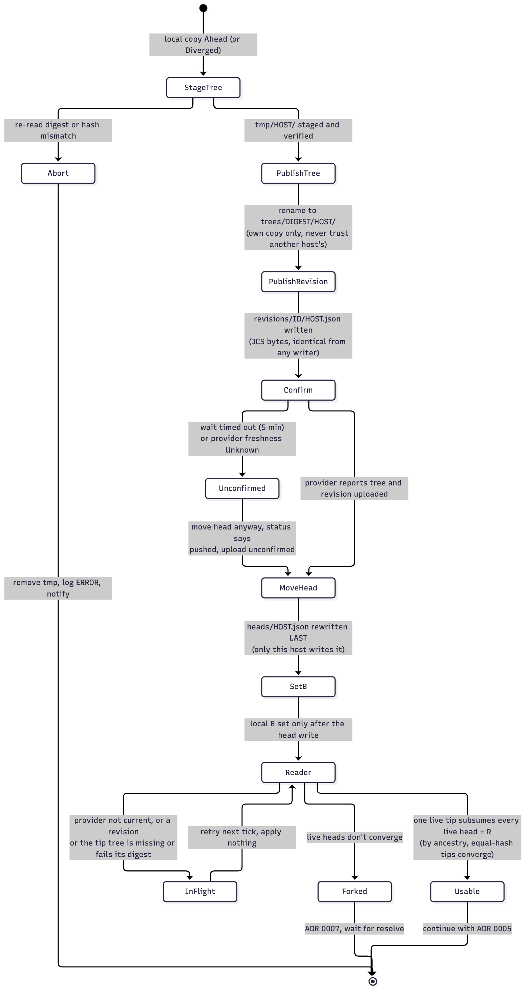

# 0009. Store write protocol: single-writer heads over immutable revisions and trees

Status: Accepted 2026-10-01. Revised 2026-10-01 (review F1, F8, F14, F22): replaced the shared `current/` + `current.json` (last writer wins) with per-host heads and content-addressed, write-once revisions and trees. Revised 2026-10-01 (review round 2: F25, F26, F27, F34): every path is host-scoped (even identical revisions and trees are stored once per writer), revisions are never garbage-collected, stored trees hold `{{DEVICE}}` instead of raw device ids, equal-hash tips are converged, and B is set only after the head write.

## Context

The store is replicated by a sync client ([0002](0002-transport-shared-cloud-folder.md)). A reader may see a partially delivered tree or files arriving out of order. When two hosts write the same path, the client keeps one version and may create a "conflicted copy". The first design had every host rewrite the same `current/` folder and `current.json`. The review showed that this loses updates ([0005](0005-direction-detection-three-way-hash.md)).

## Decision

**Every store file has exactly one writer**: its path contains the `host_id` of the only host that writes it. Objects two hosts might both produce (an identical revision, an identical tree) are stored once per writer, and a reader accepts any copy that passes its digest check (review F26).

The single definition of the layout, the record fields and the step-by-step write protocol is **[contract D: store format](../contracts/store-format.md)**. In outline:

- `trees/<tree_digest>/<host_id>/` holds full profile trees, write-once, with variables and `{{DEVICE}}` as placeholders ([0006](0006-normalization-and-variables.md)). A push always uploads its own copy rather than trusting another host's.
- `revisions/<revision_id>/<host_id>.json` holds write-once records containing exactly the id-hashed fields (`hash`, `tree`, `parents`, `norm_version`, `fingerprint`, `kind`), so every writer's bytes are identical. Author, time and app version live in the writer's head and event line.
- `heads/<host_id>.json` is each host's own pointer, written **last** in a push; the host's local B is set only after that write succeeds.
- R is the revision that subsumes every live head; tips with equal `hash` are converged, not forked. No R means **Forked**, which is detectable.
- A reader first checks freshness with the provider; then a head whose revision, or whose tip tree, is missing or digest-invalid makes the profile **InFlight**: it retries next tick and never applies.
- **Revisions are never garbage-collected**; only tree copies are, and never a pinned one ([contract D § garbage collection](../contracts/store-format.md#garbage-collection-trees-only), [0027](0027-store-lifecycle.md)).
- Per-host data (`hosts/<host_id>.toml`, `events/<host_id>.jsonl`, `inventory/<host_id>.json`, `tmp/<host_id>/`) is owned by that host ([0010](0010-host-identity-and-config-layering.md)).
- The common `config.toml` is the only multi-writer file. It holds shared settings only, is rarely written, and has an explicit conflict path (`schrodeck config resolve`, [0010](0010-host-identity-and-config-layering.md)).
- File identity uses the allow-list from [contract C](../contracts/profile-format.md#file-allow-list), so stray `.DS_Store`, conflicted copies or `.icloud` placeholders can't wedge a profile in flight.

## Consequences

- Good: concurrent pushes can't overwrite each other; they show up as a fork ([0007](0007-conflict-policy.md)).
- Good: a half-delivered push is never applied, and its arrival order doesn't matter.
- Good: the history of every profile is in the store, so the shared history ring is just the revision chain ([0011](0011-history-and-rollback.md)).
- Bad: more files than the old design, a tree GC is needed ([0027](0027-store-lifecycle.md)), and identical content pushed by two hosts is stored twice. Concurrent identical pushes are rare, so the duplication is small.
- Risk: a sync client that delivers a head long before its tree keeps the profile InFlight for that time. The stuck-in-flight alarm ([0023](0023-store-freshness-via-file-provider.md)) surfaces it.

## Alternatives considered

- **Shared `current/` + `current.json`, last writer wins** (the first design): loses updates. Rejected after review (F1).
- **Shared `current.json` with a `parent` field plus conflict-copy scanning:** still multi-writer, and depends on the provider's conflict-copy behavior, which we have never observed. Rejected.
- **Symlink `ProfilesV3` into the cloud folder:** the app rewrites files on every launch on every host, producing conflicted copies and no per-host path rewriting.
- **A single shared log/inventory file:** concurrent appends create conflicted copies.

## Verified by

No check yet; to be written in the plan (see also [contract D § enforced by](../contracts/store-format.md#enforced-by)):
- A head whose tree is missing a file or has a truncated file ⇒ InFlight, no apply.
- Extra files (`.DS_Store`, `x (conflicted copy).json`, `.icloud`) in a tree ⇒ same `tree_digest`, not InFlight.
- Two simulated hosts pushing concurrently ⇒ Forked on both. Known-bad: the old shared-file protocol loses one edit in the same test.
- An unknown or newer `FORMAT` ⇒ refuse to write.
- The single-writer property: over a simulated multi-host run, **including two hosts producing the identical revision and tree**, every store path is written by at most one host (except `config.toml`). Known-bad: a host-less revision path must fail it.
- No raw device id reaches the store: every stored tree has `{{DEVICE}}` and no `@(` device string.

## References

- None from Elgato (store design).
