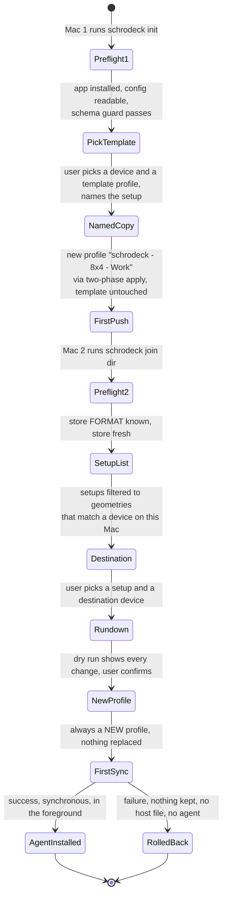

# 0022. Onboarding: `init` creates a setup from a template; `join` adds a new member copy

Status: Accepted 2026-10-01. Revised 2026-10-01 (review F13, F16): join never replaces existing local profiles, subscribing is chosen in the rundown, and the agent install moves to the milestone that can do it safely. Revised 2026-10-01 (reframe: template-seeded setups): `init` picks a device and a template and creates a new named member copy; `join` lists only geometry-compatible setups and always creates a new profile on a chosen destination device; the old rename suggestion is replaced by the member copy's fixed name.

## Context

A setup starts on one Mac and grows ([0029](0029-problem-statement-and-setup-model.md)). Joining must never surprise anyone. The second Mac may already have its own profiles, different plugins, and paths that need variable values. Onboarding is also the first time schrodeck writes that Mac's Stream Deck files.

## Decision

**`schrodeck init`** on the first Mac:

1. **Preflight:** the Stream Deck app is installed and its config is readable (profiles directory, prefs, a fingerprint that passes the schema guard, ADR [0015](0015-schema-guard.md)). If not, fail with a plain message saying what is missing. Never create a half-configured store.
2. **Choose the shared directory.** schrodeck suggests candidates (Dropbox, then iCloud Drive, ADR [0010](0010-host-identity-and-config-layering.md)) and writes `FORMAT`, the common config and this Mac's `hosts/<host_id>.toml`.
3. **Choose the template:** schrodeck lists this Mac's devices, then the profiles on the chosen device. The user picks a device, a template profile, and a setup name.
4. **Create the member copy:** a **new** profile on the same device, copied from the template and named `schrodeck - <cols>x<rows> - <name>` (e.g. `schrodeck - 8x4 - Work`). It gets a new `profile_id` ([0026](0026-profile-identity.md)). **The template is never opened for writing.** Creating the profile writes to the app's files and restarts the app, so it goes through the two-phase apply ([0008](0008-two-phase-apply.md)), with a dry-run preview first.
5. **First push** of the setup's root revision. Only after it succeeds, and from M4 on, is the background agent ([0012](0012-triggers.md)) installed. The package never installs it ([0028](0028-distribution-brew-tap-and-pkg.md)).

`schrodeck share` on any later Mac runs steps 3 to 5 to add another setup.

**`schrodeck join <dir>`** on each additional Mac:

1. **Preflight**, as above. Also refuse if `<dir>` has no store `FORMAT` file, or has an unknown or newer one, or if its freshness check fails (ADR [0023](0023-store-freshness-via-file-provider.md)).
2. **List the setups** in the store, **filtered to those whose geometry matches a device on this Mac**. Setups with no compatible local device are listed separately as "no compatible deck here", for information only.
3. **The user picks** a setup and a **destination device**. If more than one local device matches, the user chooses; `--deck` is required for non-interactive use. Join subscribes to nothing by default.
4. **Dry run, nothing touched.** Print a rundown of exactly what accepting would do:
   - for each chosen setup, the **new** profile that will be created, its name, and its destination device;
   - that **no existing local profile is replaced or modified**, and that this Mac's existing configuration is **not** brought into any setup;
   - the restore point that will be taken first;
   - missing plugins, scripts and Shortcuts;
   - variables that need a value on this Mac.
5. **Ask for confirmation.** `--yes` is for scripted installs and requires explicit setup and `--deck` choices. `--json` prints the rundown for a UI.
6. **On accept, the first sync runs synchronously in the foreground** through the normal two-phase apply ([0008](0008-two-phase-apply.md)), with progress output.
7. **Only after it succeeds:**
   - this Mac's `hosts/<host_id>.toml` is written;
   - from M4 on, the background agent ([0012](0012-triggers.md)) is installed.

   If the first sync fails, everything rolls back, no head or host file is written, and no agent is installed.

`schrodeck subscribe` later on a joined Mac runs steps 2 to 6 for one more setup.

**Joiners never bring their own config into the system.** Merging two computers' existing configurations is out of scope. It can be done by hand (quit the Stream Deck app and edit the profile files, or copy buttons in the app), at the user's own risk. schrodeck won't manage it, and the documentation says so.

## Consequences

- Good: the riskiest moment, a Mac's first apply, happens while the user is watching, after a full preview.
- Good: a failed join leaves no background agent fighting a broken state, and no trace in the store.
- Good: no onboarding path can overwrite a profile the user already had. schrodeck only creates profiles.
- Good: the fixed member-copy name makes synced profiles visible in Elgato's UI at a glance.
- Bad: `join` is interactive by default. Fleet installs need `--yes` with explicit choices, and then the preview is only in the log.
- Bad: a user who wants their current profile synced gets a copy next to it, and must delete the original by hand if they want.

## Alternatives considered

- **Join silently and let the background agent do the first sync:** the first apply rewrites the app's files on a Mac whose state we have never seen, so it deserves a preview and a watching human.
- **Auto-subscribe every compatible setup:** surprising, and it can fill decks with profiles the user didn't want.
- **Adopt or replace an existing local profile as the member copy:** risks overwriting local work and imports the joiner's config. Rejected: always a new profile.
- **Share the chosen profile in place, with an optional rename** (the previous version of this ADR): the user's own profile became a sync target. Replaced by template-seeded copies.
- **Identity by profile name** (anything named `schrodeck - …` is synced): renames would break sync, and a user could opt in by accident. The name stays a visual cue only.
- **`join` without a directory, by auto-discovery:** two candidate stores are ambiguous (ADR 0010). Discovery only *suggests*.

## Verified by

No check yet; to be written in the plan. Required tests:
- `init`: the template is never opened for writing (filesystem-port assertion). Exactly one new profile is created, with the expected name and normalized content equal to the template's.
- Dry-run `init`/`join`: **no file under the app's data root or the store is opened for writing**, asserted at the filesystem-port level. Byte comparison of the app's files would be fooled by the running app's own rewrites. Known-bad: a dry run that stages beside the target must fail.
- `join`'s setup list contains only geometry-compatible setups (known-bad: a fixture of another geometry must not be offered as a destination).
- A join whose first apply fails leaves no LaunchAgent, no `hosts/<host_id>.toml`, and no head.
- Preflight fails cleanly when the app is absent.
- With an existing local profile of the same name on the destination, join creates a new profile and leaves the existing one untouched.

## References

- Close the app before changing its files: [R3](../references.md) (documented).
- Profiles are device-specific, hence geometry matching: [R8, R10](../references.md) (documented).
