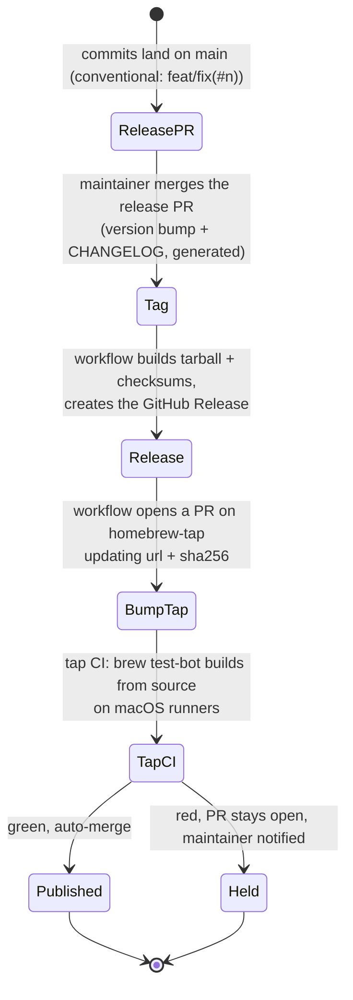

# 0028. Distribution: a Homebrew tap now, a signed `.pkg` later

Status: Accepted 2026-10-01 (Homebrew tap). The `.pkg` part is **Deferred** until there is an Apple Developer ID.

## Context

schrodeck ships three pieces: the Go CLI/agent binary, the Swift notifier app, and a LaunchAgent. Each has its own constraint:

- The notifier must sit in an `Applications` folder (`~/Applications` was verified) for macOS to allow its notifications at all (ADR [0016](0016-notifications.md)).
- Binaries **downloaded** from the internet are quarantined. Without a Developer ID signature and notarization, Gatekeeper blocks them. Binaries **built locally** are not quarantined, and the notifier spike showed that an ad-hoc-signed local build works.
- The LaunchAgent must be installed only **after** a successful first sync (ADR [0022](0022-onboarding-init-and-join.md)), so the package manager must not install or start it.

Target users are Mac users comfortable with a terminal, who very likely already have Homebrew.

## Decision

**Primary channel: a Homebrew tap**, `csmarshall/homebrew-tap`, so users run `brew install csmarshall/tap/schrodeck`.

- A **formula that builds from source** (Go + `swiftc`): no Developer ID, no notarization, no quarantine, and the same ad-hoc-signed path the spike proved. It requires the Xcode Command Line Tools, which provide `swiftc` (declared as a dependency).
- The formula installs the CLI and builds `SchrodeckNotifier.app` into the Homebrew prefix. **It does not install the LaunchAgent and does not use `brew services`.** schrodeck owns its agent lifecycle: `join`/`init` install it after the first sync succeeds, and `schrodeck uninstall` removes it (ADR [0027](0027-store-lifecycle.md)).
- `init`/`join` copy the notifier app into `~/Applications` and register it. Whether an app running straight from the Homebrew prefix (or a symlink to it) gets notification permission is **unverified**. Copying matches the verified path, and `doctor` checks the copy is current.
- Upgrades go through `brew upgrade`. Mixed schrodeck versions across hosts are handled by store `FORMAT` / `norm_version` compatibility (ADR [0027](0027-store-lifecycle.md), contract D), not by the installer. After an upgrade, `doctor` re-copies the notifier if it changed.
- A **GitHub Release** per tag (source tarball + checksums) is what the formula builds from, produced by CI.

**Secondary channel, deferred: a signed and notarized `.pkg`** (universal binary + notifier app) for users without Homebrew.

- It needs an Apple Developer ID ($99/year) and a notarization step in CI. Without them, a `.pkg` is blocked by Gatekeeper, which is worse than not offering one.
- It becomes worth doing when the user base or a commercial edition justifies it (see ADR [0020](0020-project-hygiene-naming-license.md)). Even then, the `.pkg` installs files only. The agent still waits for `join`.

## Release automation: nothing is managed by hand

Releasing is **merging one PR**. GitHub Actions does the rest:

1. **Versioning and changelog:** a release-please-style action reads the conventional commit messages the repo already uses (`feat(#n):`, `fix(#n):`). It keeps one open "release PR" that bumps the version and writes the CHANGELOG. Merging that PR is the only manual step, and it creates the tag and the GitHub Release.
2. **Build artifacts:** a release workflow, triggered by the tag, builds the source tarball and checksums and attaches them to the Release. It also runs the full test suite on macOS one last time.
3. **Tap update:** the same workflow opens a PR on `csmarshall/homebrew-tap` that updates the formula's `url` and `sha256`. The formula's build steps are written once, by hand, and only the version pointer changes per release. Auth uses a token scoped to the tap repo only (a fine-grained PAT or a GitHub App), stored as a secret.
4. **Tap CI:** the tap repo carries the workflows Homebrew generates with `brew tap-new` (`brew test-bot` on macOS runners). If the formula builds and its test passes, the bump PR auto-merges. If not, it stays open and the maintainer is notified. A broken build never reaches users.
5. **Later, the `.pkg`:** one extra job in the same release workflow: build a universal binary, sign it with the Developer ID certificate (stored as an encrypted secret), `xcrun notarytool submit --wait`, staple, and attach it to the Release. It needs no other process changes.

Third-party actions are **pinned by commit SHA**, not by tag, and kept current by Dependabot. The specific actions are chosen in the implementation plan. Candidates: googleapis/release-please-action and a formula-bump action such as mislav/bump-homebrew-formula-action, or `brew bump-formula-pr` run directly.

## Consequences

- Good: a release is one merge. Users get it through `brew upgrade`, and a formula that fails to build is held back automatically.
- Good: no signing infrastructure or Apple account is needed to ship v1, and the install path matches the one already tested.
- Good: one command installs and upgrades, and the agent lifecycle stays under schrodeck's control (onboarding safety is preserved).
- Bad: users need the Command Line Tools, and the first install compiles (slower than a bottle). Bottles can be added later, but downloaded bottles reintroduce the quarantine and signing question for the notifier.
- Bad: without Homebrew there is no supported install until the `.pkg` exists.
- Risk: Homebrew policy or macOS changes could affect locally built, ad-hoc-signed apps. `doctor`'s notifier probe surfaces this.

## Alternatives considered

- **Homebrew cask with a prebuilt app:** quarantined download, so it needs Developer ID signing. Deferred with the `.pkg`.
- **Submission to homebrew-core:** possible later, with requirements (notability, stable releases, no self-managed agents). The tap first.
- **`brew services` to run the agent:** rejected. It starts the agent at install time, before any successful first sync (violates ADR 0022), and it can't express our triggers (watch paths, optional device attach).
- **`go install` only:** no notifier app, no agent. Fine for developers, not for users.
- **An unsigned `.pkg` now:** blocked by Gatekeeper; teaches users to bypass security prompts. Rejected.

## Verified by

No check yet; to be written in the plan:
- CI on a macOS runner: `brew install --build-from-source` of the formula from the tap, then `brew test schrodeck`. The test runs `schrodeck --version` and `schrodeck doctor --json` in a sandbox. Known-bad: a formula with a broken build step must fail CI.
- An install-then-check test: after `brew install`, no LaunchAgent exists until `join` succeeds.
- Release pipeline dry run: a pre-release tag (`v0.0.1-rc1`) goes all the way to a tap bump PR. Known-bad: a deliberately broken formula bump must stay unmerged.
- A spike before M4: does the notifier get notification permission when launched from `~/Applications` after being copied from a Homebrew build? Copying from the prefix is the plan; launching directly from the prefix is to be tested.

## References

- Notifier location requirement: ADR [0016](0016-notifications.md) (verified on one Mac, macOS 27).
- Apple: [Notarizing macOS software before distribution](https://developer.apple.com/documentation/security/notarizing-macos-software-before-distribution) (documented by Apple).
