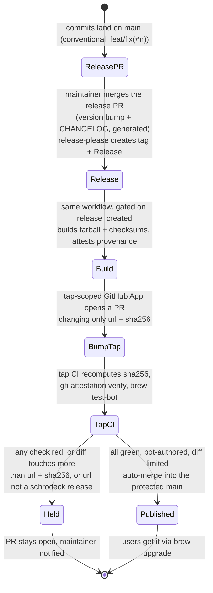

# 0028. Distribution: a Homebrew tap now, a signed `.pkg` later

Status: Accepted 2026-10-01 (Homebrew tap). The `.pkg` part is **Deferred** until there is an Apple Developer ID. Revised 2026-10-01 (review round 2: F35, F36, F37, F38): an explicit auto-merge trust boundary with provenance checks, jobs chained on release-please's output, generated workflows pinned, and the agent installed by `init`/`join` only.

## Context

schrodeck ships three pieces: the Go CLI/agent binary, the Swift notifier app, and a LaunchAgent. Each has its own constraint:

- The notifier must sit in an `Applications` folder (`~/Applications` was verified) for macOS to allow its notifications at all (ADR [0016](0016-notifications.md)).
- Binaries **downloaded** from the internet are quarantined. Without a Developer ID signature and notarization, Gatekeeper blocks them. Binaries **built locally** are not quarantined, and the notifier spike showed that an ad-hoc-signed local build works.
- The LaunchAgent must be installed only **after** a successful first sync (ADR [0022](0022-onboarding-init-and-join.md)), so the package manager must not install or start it.

Target users are Mac users comfortable with a terminal, who very likely already have Homebrew.

## Decision

**Primary channel: a Homebrew tap**, `csmarshall/homebrew-tap`, so users run `brew install csmarshall/tap/schrodeck`.

- A **formula that builds from source** (Go + `swiftc`): no Developer ID, no notarization, no quarantine, and the same ad-hoc-signed path the spike proved. It requires the Xcode Command Line Tools, which provide `swiftc` (declared as a dependency).
- The formula installs the CLI and builds `SchrodeckNotifier.app` into the Homebrew prefix. **It does not install the LaunchAgent and does not use `brew services`.** schrodeck owns its agent lifecycle: `init` installs it after its first push succeeds, and `join` after its first sync succeeds (ADR [0022](0022-onboarding-init-and-join.md)); `schrodeck uninstall` removes it (ADR [0027](0027-store-lifecycle.md)).
- `init`/`join` copy the notifier app into `~/Applications` and register it. Whether an app running straight from the Homebrew prefix (or a symlink to it) gets notification permission is **unverified**. Copying matches the verified path, and `doctor` checks the copy is current.
- Upgrades go through `brew upgrade`. Mixed schrodeck versions across hosts are handled by store `FORMAT` / `norm_version` compatibility (ADR [0027](0027-store-lifecycle.md), contract D), not by the installer. After an upgrade, `doctor` re-copies the notifier if it changed.
- A **GitHub Release** per tag (source tarball + checksums) is what the formula builds from, produced by CI.

**Secondary channel, deferred: a signed and notarized `.pkg`** (universal binary + notifier app) for users without Homebrew.

- It needs an Apple Developer ID ($99/year) and a notarization step in CI. Without them, a `.pkg` is blocked by Gatekeeper, which is worse than not offering one.
- It becomes worth doing when the user base or a commercial edition justifies it (see ADR [0020](0020-project-hygiene-naming-license.md)). Even then, the `.pkg` installs files only. The agent still waits for `join`.

## Release automation: nothing is managed by hand

Releasing is **merging one PR**. GitHub Actions does the rest:

1. **Versioning and changelog:** a release-please-style action reads the conventional commit messages the repo already uses (`feat(#n):`, `fix(#n):`). It keeps one open "release PR" that bumps the version and writes the CHANGELOG. Merging that PR is the only manual step. release-please then creates the tag and the GitHub Release.
2. **Build artifacts, chained, not tag-triggered** (review F36): a tag or release created with the default `GITHUB_TOKEN` does **not** trigger other `on: push: tags` / `on: release` workflows. So the build runs as later jobs in the **same** release-please workflow run, gated on its `release_created` output (the alternative is to have release-please use a GitHub App token, whose events do trigger workflows). These jobs build the source tarball and checksums, run the full test suite on macOS one last time, attach the artifacts to the Release, and create a **build-provenance attestation** for the tarball with GitHub's artifact-attestation action.
3. **Tap update:** a **GitHub App installed only on `csmarshall/homebrew-tap`** (preferred over a PAT, because its scope and lifetime are narrower), with contents and pull-request write permission on that one repo, opens a PR that changes **only** the formula's `url` and `sha256`. The formula's build steps are written once, by hand, and only the version pointer changes per release.
4. **Tap CI and the auto-merge trust boundary** (review F35). The tap repo's `main` is **protected**: changes only by PR, required status checks, no direct pushes, including by the App. The bump PR auto-merges only if **all** of these hold, checked by a workflow in the tap repo (not by the release workflow, which is the thing being guarded against):
   - the PR was opened by the release App's bot account;
   - its diff touches only the `url` and `sha256` lines of the formula;
   - `url` matches `https://github.com/csmarshall/schrodeck/releases/download/v*`;
   - CI downloads that URL and **recomputes** the sha256 (it must equal the PR's value);
   - `gh attestation verify` confirms the tarball was built by the schrodeck repo's release workflow;
   - `brew test-bot` (the workflows `brew tap-new` generates) builds the formula from source on macOS and runs its test.

   Anything else leaves the PR open for a human and notifies the maintainer. A compromised release job or App token can therefore at worst open a PR that a human must read; it can't ship a tarball that wasn't built by the release workflow from this repo.
5. **The formula's test** (review F36) runs on a CI runner with no Stream Deck app. It asserts only that `schrodeck --version` prints the formula's version, and that `schrodeck doctor --json` exits with the documented "app not installed" status and emits JSON that validates against the `doctor` schema ([contract E](../contracts/README.md)). It never asserts a passing doctor.
6. **Later, the `.pkg`:** one extra job in the same gated chain: build a universal binary, sign it with the Developer ID certificate (stored as an encrypted secret), `xcrun notarytool submit --wait`, staple, attest, and attach it to the Release. It needs no other process changes.

**Pinning** (review F37): every third-party action, including the ones in the workflows `brew tap-new` generates (which reference Homebrew's actions by branch), is **pinned by commit SHA**. Dependabot proposes SHA bumps, and those PRs **always need human review**, never auto-merge: an action bump changes what runs with the release credentials. The specific actions are chosen in the implementation plan. Candidates: googleapis/release-please-action, actions/attest-build-provenance, and a formula-bump action such as mislav/bump-homebrew-formula-action, or `brew bump-formula-pr` run directly.

## Consequences

- Good: a release is one merge. Users get it through `brew upgrade`, and a formula that fails to build, or that points anywhere but a provenance-verified schrodeck release, is held back automatically.
- Bad: the tap's protections (branch protection, App installation, the guard workflow) are configuration outside this repo. The plan includes a checklist and a periodic check that they are still in place.
- Good: no signing infrastructure or Apple account is needed to ship v1, and the install path matches the one already tested.
- Good: one command installs and upgrades, and the agent lifecycle stays under schrodeck's control (onboarding safety is preserved).
- Bad: users need the Command Line Tools, and the first install compiles (slower than a bottle). Bottles can be added later, but downloaded bottles reintroduce the quarantine and signing question for the notifier.
- Bad: without Homebrew there is no supported install until the `.pkg` exists.
- Risk: Homebrew policy or macOS changes could affect locally built, ad-hoc-signed apps. `doctor`'s notifier probe surfaces this.

## Alternatives considered

- **Homebrew cask with a prebuilt app:** quarantined download, so it needs Developer ID signing. Deferred with the `.pkg`.
- **Submission to homebrew-core:** possible later, with requirements (notability, stable releases, no self-managed agents). The tap first.
- **`brew services` to run the agent:** rejected. It starts the agent at install time, before any successful first sync (violates ADR 0022), and it can't express our triggers (watch paths, optional device attach).
- **`go install` only:** no notifier app, no agent. Fine for developers, not for users.
- **An unsigned `.pkg` now:** blocked by Gatekeeper; teaches users to bypass security prompts. Rejected.

## Verified by

No check yet; to be written in the plan:
- CI on a macOS runner: `brew install --build-from-source` of the formula from the tap, then `brew test schrodeck`, asserting only the version string and the JSON shape and exit status of `doctor --json` without the app. Known-bad: a formula with a broken build step must fail CI.
- **Trust-boundary tests** on the tap's guard workflow, each of which must leave the PR unmerged: a bump PR from a non-bot author; a diff that also edits the `install` block; a `url` outside `csmarshall/schrodeck/releases/download/v*`; a `sha256` that doesn't match the downloaded tarball; a tarball without a valid attestation. Known-good: a genuine bump auto-merges.
- A release dry run confirms the build jobs actually run after release-please creates the release (the F36 trap: if they were tag-triggered with the default token, this run would produce no artifacts).
- An install-then-check test: after `brew install`, no LaunchAgent exists until `join` succeeds.
- Release pipeline dry run: a pre-release (`v0.0.1-rc1`) goes all the way to a tap bump PR. Known-bad: a deliberately broken formula bump must stay unmerged.
- A spike before M4: does the notifier get notification permission when launched from `~/Applications` after being copied from a Homebrew build? Copying from the prefix is the plan; launching directly from the prefix is to be tested.

## References

- Notifier location requirement: ADR [0016](0016-notifications.md) (verified on one Mac, macOS 27).
- GitHub: artifact attestations and `gh attestation verify` (documented by GitHub; specific actions chosen and pinned in the plan).
- Apple: [Notarizing macOS software before distribution](https://developer.apple.com/documentation/security/notarizing-macos-software-before-distribution) (documented by Apple).
