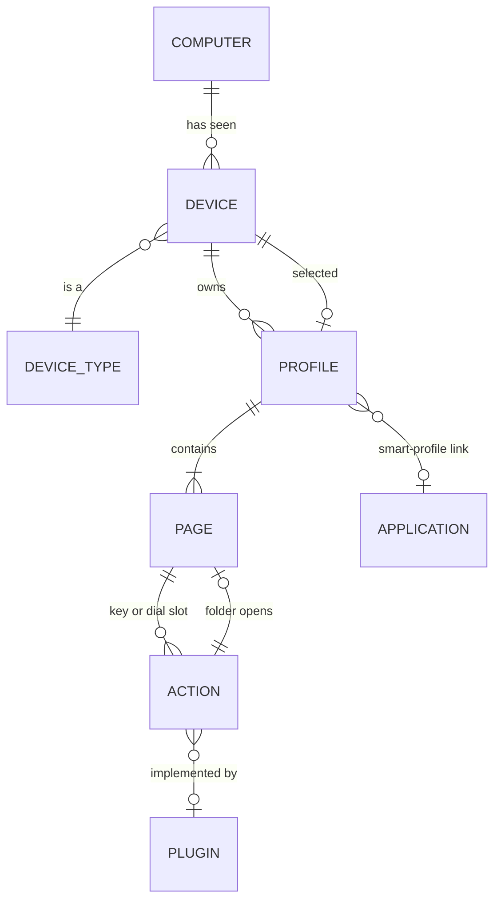

# How the Stream Deck app organizes configuration

The data model schrodeck syncs, as far as we know it. Every statement is marked:

- **documented**: Elgato states it (source in [references.md](references.md));
- **observed**: seen on a real machine (one Mac, app 7.5.1, three physical decks + one virtual), not promised by Elgato;
- **unknown**: not yet established, with the probe that would settle it.

The checkable assertions derived from this page live in [contract B](contracts/client-os.md) and [contract C](contracts/profile-format.md). This page explains the model; the contracts test it.

## The model

| Entity | What it is | Identity | Basis |
|---|---|---|---|
| **Computer** | one macOS user account on one machine | schrodeck's `host_id` (ADR [0010](adr/0010-host-identity-and-config-layering.md)) | ours |
| **Device** | one deck the app has seen on this computer: physical (USB) or virtual | the app's device key `@(1)[<vendor>/<product>/<serial>]`; virtual decks show `@(0)[]` | observed [R9, R14] |
| **Device type** | the hardware model, which fixes the geometry (columns × rows, + dials) | the USB product id; Elgato's DeviceType enum (Stream Deck, Mini, XL, +, Neo, + XL, Virtual…) | documented [R8] |
| **Profile** | a complete button layout for **one** device | the `.sdProfile` folder UUID (local to the computer) | observed [R2] |
| **Page** | one screen of a profile; a profile has an ordered list of pages | a page UUID folder under `Profiles/` | observed [R2] |
| **Folder** | a button that opens a sub-page; stored as another page folder in the same profile | page UUID | observed (structure); exact folder-vs-page encoding **unknown** (probe P9 below) |
| **Action** | what one key or dial does: plugin, settings, title, icon, states | its slot position on the page (e.g. `3,1`) | observed [R2]; settings format documented [R7] |
| **Plugin** | code implementing actions; installed per computer; its global settings are per computer | plugin UUID (e.g. `com.elgato.…`) | documented [R6, R7] |
| **Selected profile** | the profile a device currently shows | stored **per device** in the app's preferences, not in the profile | observed [R14] |
| **Smart profile** | a profile that switches in when a given application is focused | `AppIdentifier` in the profile manifest (**meaning unclear**; see U3) | documented [R13] (feature); encoding unknown |

## Cardinalities

| Relationship | Cardinality | Basis |
|---|---|---|
| Computer → Devices | **1 → N** (every deck the app has ever seen, connected or not, incl. virtual) | observed: 4 device records on one Mac, one of them virtual |
| Device → Device type | **N → 1** | documented [R8] |
| Device → Profiles | **1 → N** (a device can have many profiles; on the observed Mac each has exactly one) | observed + documented (profiles are created per device in the app's UI) |
| **Profile → Device** | **N → 1, exactly one.** A profile's manifest names exactly one `Device` (model + key). A profile is never shared between two devices, not even two of the same type | observed [R9] on every profile |
| Device → Selected profile | **1 → 0..1** | observed [R14]; the virtual deck's selected id points to a profile that **doesn't exist on disk** (U4) |
| Profile → Pages | **1 → 1..N**, ordered | observed |
| Profile → its "Default" page entry | **1 → 1**: every observed profile has one extra page folder with **0** actions that the manifest's `Pages.Default` points to | observed; **meaning unknown** (U2) |
| Page → Actions | **1 → 0..(columns × rows [+ dials])** | observed; the bound is from geometry [R8] |
| Action → Plugin | **N → 0..1** (built-ins like Open/Hotkey are `com.elgato.streamdeck.system.*`) | observed |

## Can a profile move between deck types?

**Short answer: a profile *instance* never moves. It belongs to exactly one device. A *copy* can be made for another device of the same type; across types is unknown and, for schrodeck, out of scope.**

| Move | What the app does | Basis | schrodeck |
|---|---|---|---|
| Same device type, different physical deck (XL → another XL) | Import lets you choose the target device (6.5+). On disk the copy differs only in `Device.UUID` | documented (choose device on import [R10]); same-type copy = rewriting `Device.UUID` is **observed by design, not yet probed** (contract B M4 round-trip) | **Yes.** This is exactly how a setup reaches another computer's XL (`{{DEVICE}}`, ADR [0006](adr/0006-normalization-and-variables.md)) |
| Different device type (XL 8×4 → Stream Deck 5×3) | **Unknown.** Elgato says profiles are device-specific ("layouts and button mappings differ across models") and the Marketplace lists which units a profile "supports" | documented that profiles are device-specific [R10]; cross-type import behavior **unknown** (U1) | **No, not in v1.** Geometry must match (ADR [0003](adr/0003-decks-are-local-geometry-compatibility.md)). Cross-geometry re-flow is a possible future feature |
| Virtual deck ↔ physical deck | Virtual decks have user-chosen geometry (up to 8×8) | documented [R12] | Same rule: allowed only if the geometry matches exactly |

## Layout combinations schrodeck has to handle

| Situation | What it looks like in the app | Notes |
|---|---|---|
| One deck per computer, same type everywhere (the core case) | each computer: 1 XL device → its profiles | the "same setup at every computer" goal |
| Several decks of different types on one computer (e.g. XL + Mini + Stream Deck, as on the observed Mac) | one device node per deck, each with its own profiles | each type is independent |
| **Two decks of the same type on one computer** (two XLs) | two device nodes with the same geometry, each with its **own** profiles | needs an explicit mapping: which setup goes to which deck (ADR [0026](adr/0026-profile-identity.md)) |
| A deck that is not connected right now | its device node and profiles remain and stay editable | documented [R11] |
| A virtual deck | device key `@(0)[]` (no serial); may have zero profiles on disk while prefs name a selected one | observed; uniqueness of `@(0)[]` with several virtual decks is **unknown** (U5) |
| A computer with no Stream Deck app installed | nothing to read | `join` refuses (ADR [0022](adr/0022-onboarding-init-and-join.md)) |

## Unknowns and the probe for each

| id | Unknown | Probe |
|---|---|---|
| U1 | What the app does when you import a profile made for a **different device type** (refuse, re-flow, truncate?) | Manual, throwaway: export a small Mini profile, import it onto the XL, inspect the result on disk. Record in [references.md](references.md). Doesn't block v1 (we refuse cross-geometry anyway) |
| U2 | What the 0-action page folder that `Pages.Default` points to is (an empty start page? a template?) | Create a fresh profile in the app, diff before/after; check whether `Default` changes when pages are reordered. Contract C row |
| U3 | What `AppIdentifier` means. It appears on two "Default Profile"s, so it may not mean "smart profile" | Create a smart profile linked to one app, diff the manifest; compare with a plain profile. Contract C row |
| U4 | Why the virtual deck's selected profile id has no folder on disk (lazy creation?) | Open the virtual deck in the app, check whether the folder appears |
| U5 | Whether several virtual decks share `@(0)[]` or get distinct keys | Create a second virtual deck, read the prefs `Devices` keys |
| P9 | How a folder button encodes its target page (the page UUID in action settings?) | Already covered by contract C P8 (profile-reference probe) |

## How schrodeck maps onto this

schrodeck syncs at the **profile** level and installs each copy onto a local **device** of the same geometry. Everything per device that isn't a profile (which profile is selected, brightness, device name) stays local (ADR [0019](adr/0019-selected-profile-stays-per-host.md)).

The refined goal ("the same setup on my XL at every computer, with no manual profile shuffling") is being worked out. It would sync the **set** of profiles owned by a device type rather than individually chosen profiles. See the open design questions in the session; this section will be updated when they're decided.
